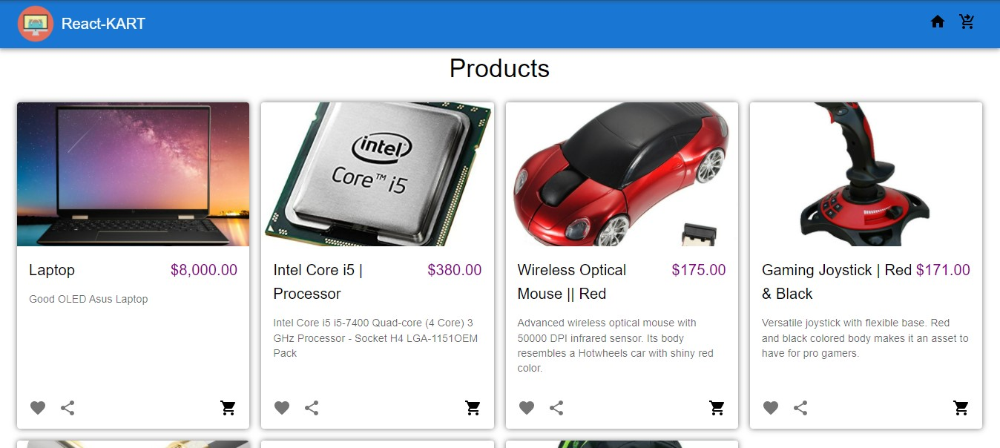
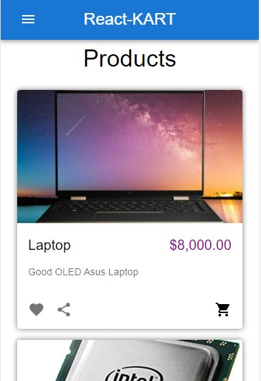
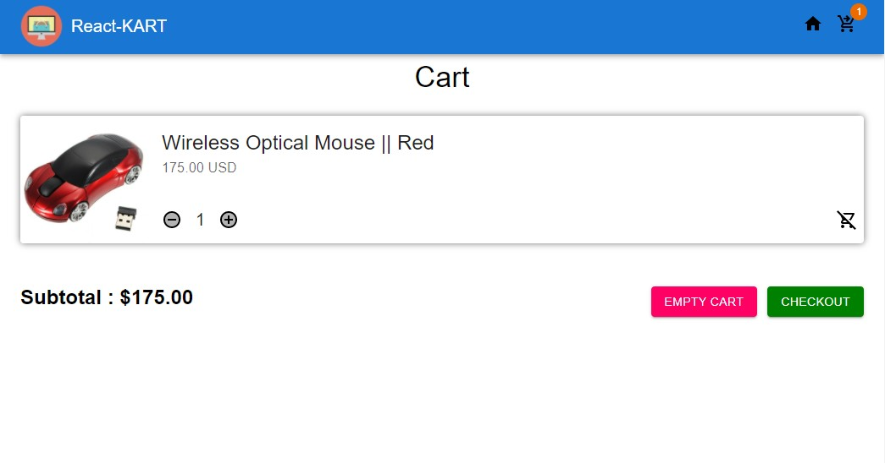
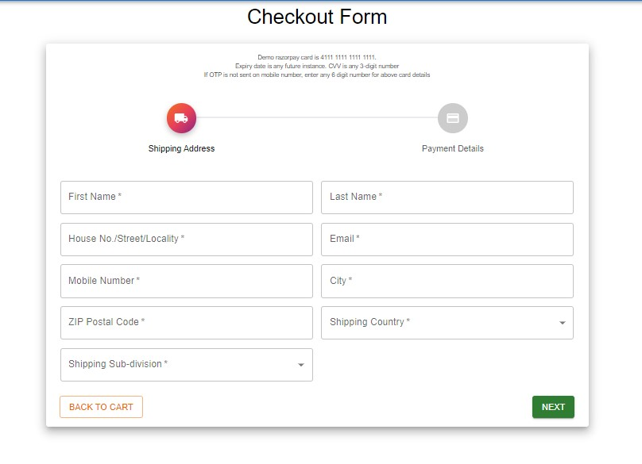
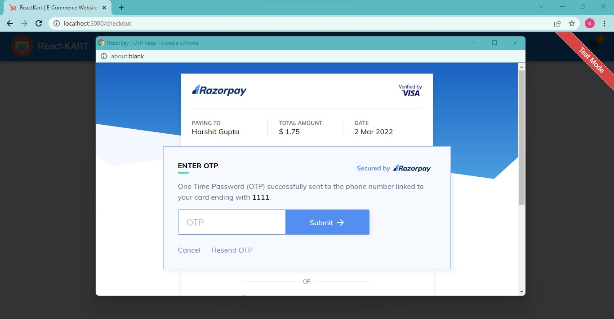

# E-Commerce 
A frontend application built using ReactJS library and integrating pre-built APIs

# Live Demo
https://reactkart-project.herokuapp.com/

## Description
It is a prototype of fully functional e-commerce website with integrated headless commerce engine/API and Razorpay payment gateway. Frontend is built using React, while backend includes very little code for payment gateway initiations. All the backend operations requiring server responses are handled by CommerceJS API. 

## Tech/framework used and Pre-requisites
* ReactJS
* NodeJS
* Express (very little)
* MaterialUI
* Commerce.js API
* Payment Gateway Integrations

## Installation
1. Download Repository
2. Install necessary modules and packages for backend and frontend files.
   ```
   (root)/> npm install
   (root)/frontend/> npm install
   ```
3. **Plug in your CommerceJS API key and RazorPay API Keys (test mode)** in place of environment variables (process.env) at 2 places :
   ``` 
   --> (root)/server-config/config.js
   --> (root)/frontend/src/config/config.js
   ```
4. Create build of frontend files
   ``` 
   (root)/frontend/> npm run build
   ```

## Usage
Hit ***npm run start*** at root location in terminal to start application in localhost.
Then, you can play around with frontend components and API calls.

## What I learnt
1. [Material UI framwork](https://mui.com/)
2. API integrations such as [Commerce.js](https://commercejs.com/) 
3. Integrating Payment Gatweways such as [RazorPay](https://razorpay.com/)
4. Use of loaders to bridge the delays between server requests and response.

## Screenshots







## Features
Negligible backend code just to handle payment calls. 
Rest is done without any complex server operations.

## API Reference
https://mui.com/getting-started/installation/

https://commercejs.com/docs/guides/products-react

https://razorpay.com/docs/payments/payment-gateway/web-integration/standard/


## Credits
I am grateful for the inspiration and detailed description to JavaScript Mastery (youtube channel)

https://youtu.be/377AQ0y6LPA
